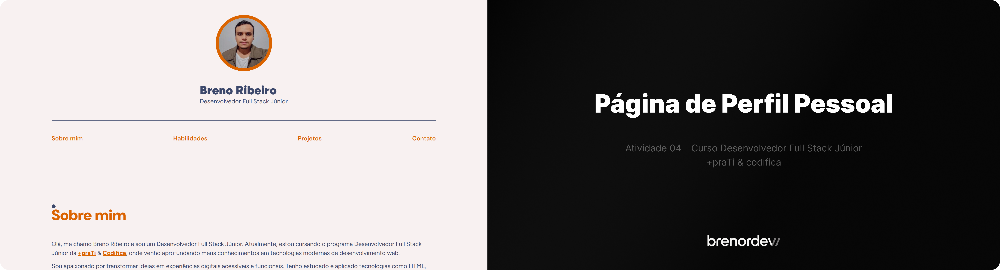

# Exercício 04

#### Curso Desenvolvedor Full Stack Júnior | +PraTI e Codifica

Este repositório contém a entrega da **Atividade 4: Página de Perfil Pessoal** desenvolvido durante o curso de **Desenvolvedor Full Stack Júnior** da [+PraTi](https://maisprati.com.br/).

## Estrutura das pastas

```
maisprati-exercices-04/ 
├── assets/
├── styles/
│   ├── normalize.css
│   ├── responsive.css
│   └── style.css
├── perfil.html
└── readme.md
```

<br/>

## Clonando este repositório

Para clonar este repositório em sua máquina local, execute o seguinte comando no terminal:

```

git clone https://github.com/brenordev/maisPraTi-exercises-04.git

```

#### Após clonar: <br/>

Ainda no terminal, digite o seguinte comando:

```

cd maisPraTi-exercises-04

```

Agora você pode abrir o projeto com seu editor de código favorito (como o VS Code) e visualizar os arquivos no navegador.

<br/>

<br/>

### Atividade 4: Página de Perfil Pessoal

    1. Repositório GitHub
    Crie um repositório público novo (ou reutilize um que já tenha para o curso).
    No README.md explique brevemente o propósito do projeto.
    
    2. Estrutura de arquivos
    Coloque na raiz do repositório:
    perfil.html
    styles.css

    3. HTML5 Semântico
    No perfil.html, utilize as seguintes tags para organizar o conteúdo:
    <header> — cabeçalho com seu nome, foto e, se quiser, slogan.
    <nav> — menu de navegação interna (âncoras para seções).
    <main> — envoltório do conteúdo principal.
    <section> — blocos temáticos, por exemplo:
    Sobre mim
    Habilidades
    Projetos
    Contato
    <article> — para “posts” ou depoimentos, se aplicável.
    <aside> — informações complementares (links, redes sociais).
    <footer> — rodapé com direitos autorais ou créditos.

    4. CSS
    Seletores
    Por elemento: h1, p, section { … }
    Por classe: .minha-classe { … }
    Por ID: #meu-id { … }
    Layout
    Use Flexbox e/ou CSS Grid para estruturar colunas e grades.
    Inclua um reset ou normalize CSS para consistência entre navegadores.
    Recursos avançados
    Variáveis CSS (:root { --cor-primaria: #0077cc; }).
    Pseudo-classes (a:hover, button:focus).
    Pseudo-elementos (section::before, article::after).
    Responsividade
    Defina media queries para diferentes larguras de tela.
    Garanta que imagens e textos reajustem-se adequadamente.
    
    5. Entrega: Envie até a data limite o link para o seu repositório no GitHub.
    Dica extra: Adicione um favicon, fontes do Google Fonts e efeitos de transição suaves (transition)
    para deixar o perfil mais atraente.
